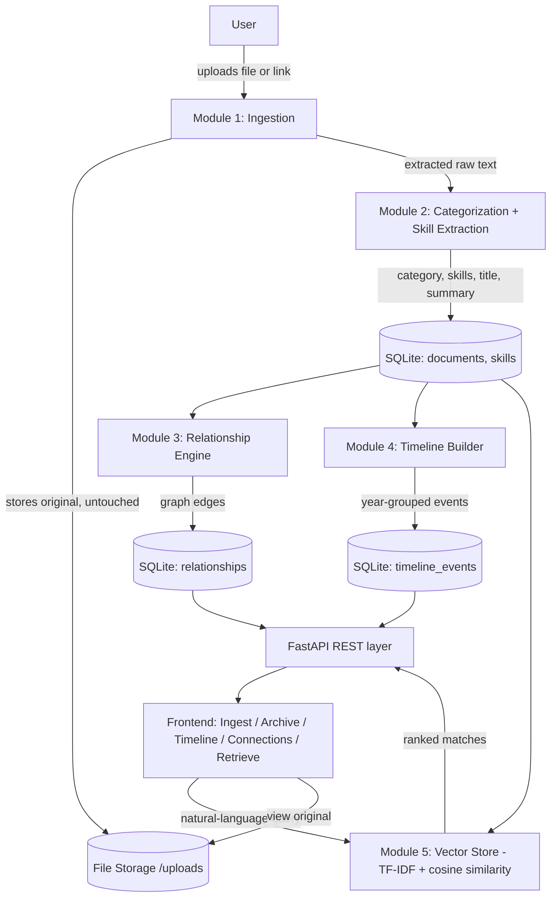
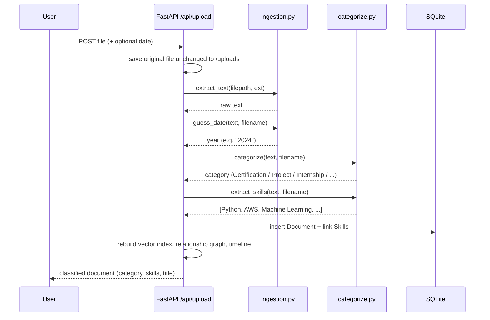
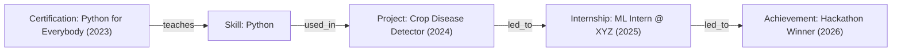
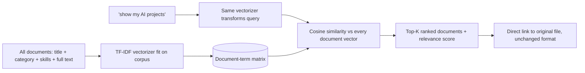
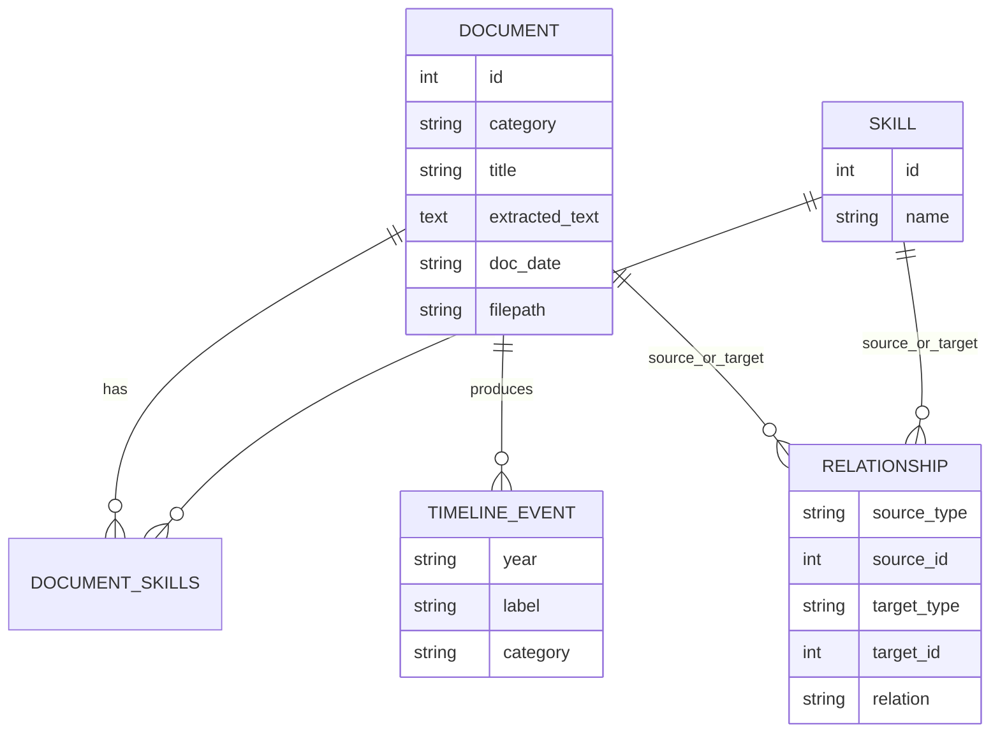

# Architecture — AI Digital Identity System

## 1. System overview

## 2. Ingestion → categorization pipeline (per document)

## 3. Relationship Engine logic

The graph connects two node types — **Document** and **Skill** — with
directional edges:

| Edge | Meaning |
|---|---|
| `Document --teaches--> Skill` | A Certification document that mentions this skill |
| `Document --mentions--> Skill` | Any other document (Project, Resume, Academic...) referencing this skill |
| `Skill --used_in--> Document(Project)` | A skill acquired via a Certification/Academic doc reappears in a Project |
| `Document(Project) --led_to--> Document(Internship)` | Shared skills between a Project and a later Internship |
| `Document(Internship) --led_to--> Document(Achievement)` | Shared skills between an Internship and a later Achievement |

This is what lets the system answer "how did I get here?" — not just "what
files do I have?"

## 4. Retrieval (semantic search)

## 5. Data model (simplified ER)

## Why this shape

- **Original files are never transformed** — only read once for text
  extraction. The file on disk is the file the user uploaded, byte for byte.
- **Every module has a narrow, swappable interface** (`categorize()`,
  `extract_skills()`, `VectorStore.search()`, `rebuild_relationships()`), so
  the rule-based NLP here can be replaced with an LLM or a real embedding
  model without touching the API layer, database schema, or frontend.
- **The relationship graph is derived, not stored redundantly** — it's
  rebuilt from documents + skills on every change, so it can never drift out
  of sync with the underlying data.
